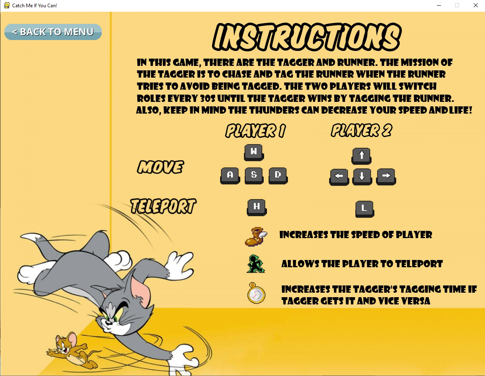
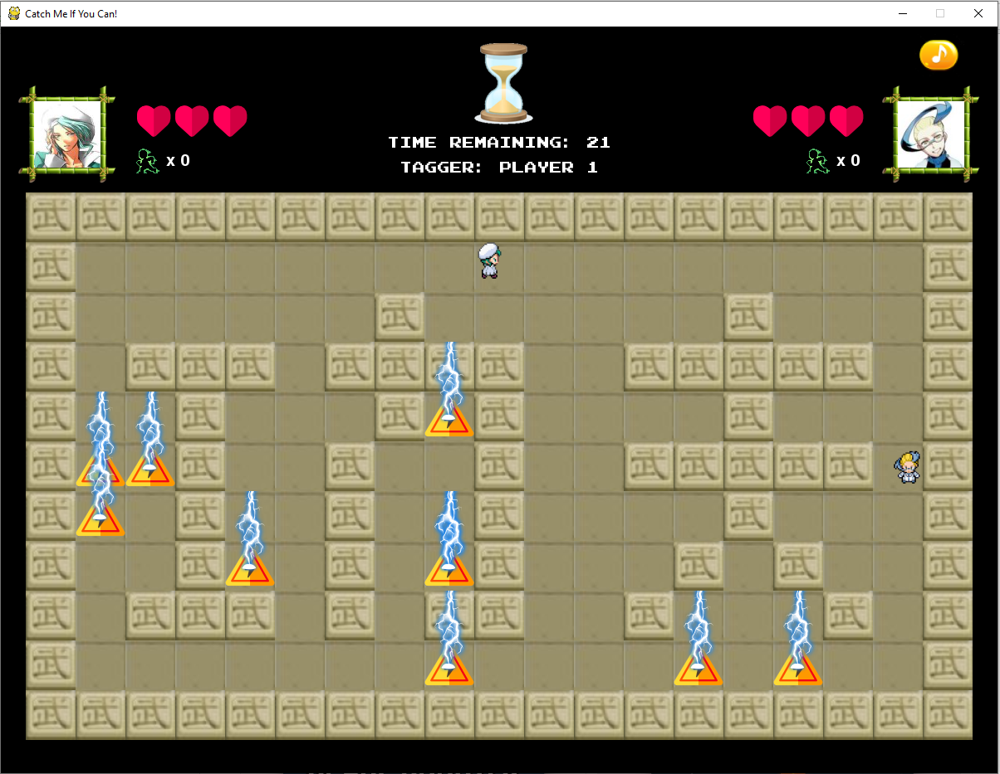

# CATCH-ME-IF-YOU-CAN-
An original two-player game written using python (pygame).
The game file is Final game 1.py

# Instruction

# You have the ability to choose your own character!

# Now try to tag/avoid the other player while dodging the lightnings!

